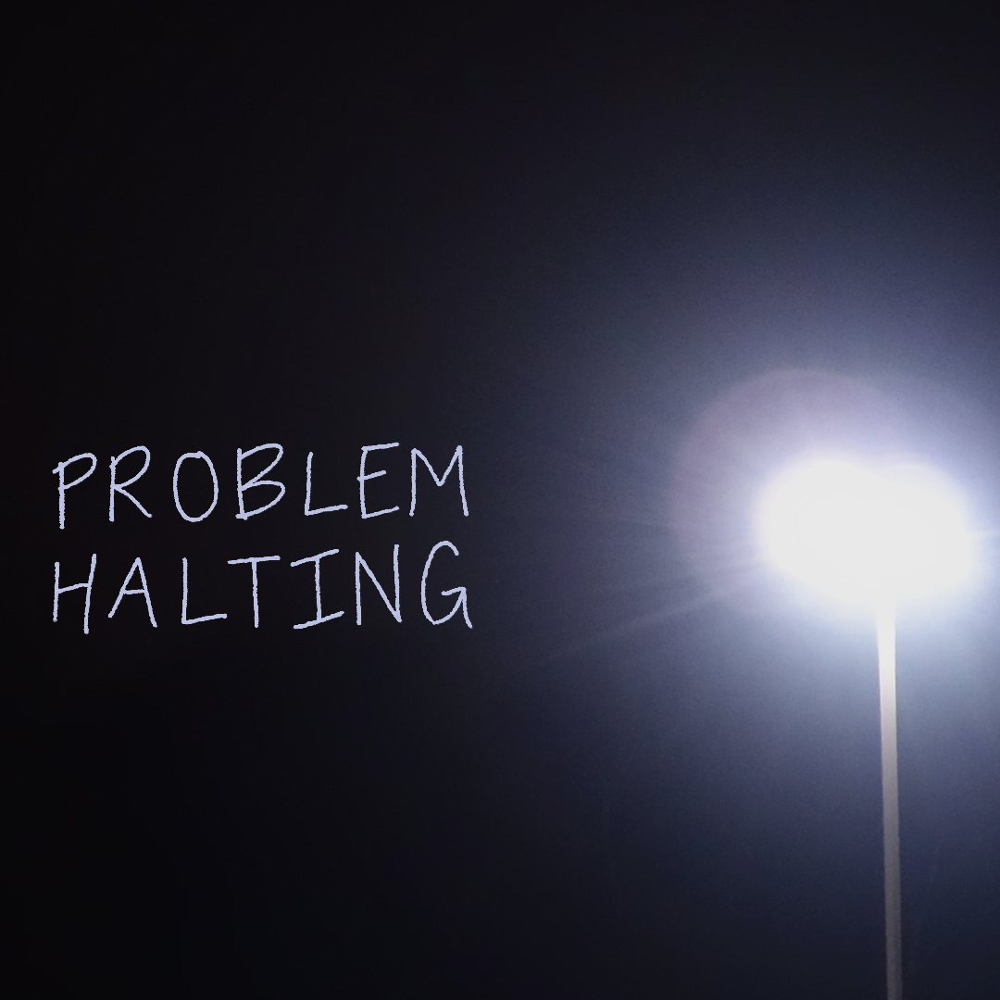

## A

Well, that's over.

## B

I made a mix the other week, it's chiefly a reflection of some recent event(s) in my life (it's "based on a true playlist")
This evening I uploaded it as a New Years'
let's-be-done-with-this ritual, I *should* rework the mixing both volumewise and track-transition-wise,
but 2016 is over so this is as well.
Feel free to down and listen.

<a href="http://163.172.215.81/ph.mp3" download="ProblemHalting.mp3">mp3 <small><code>-V0</code>, 148MB</small></a><a href="http://163.172.215.81/ph_q5.ogg" download="ProblemHalting.ogg">ogg <small><code>-q5</code>, 85MB</small></a>

Not sure how best to reliably stream in 2017 without running into
problems with content flaggers (or paying for the bandwidth myself). 
For now, <!--or at least until Dropbox axes the public folder later this year, -->here's a plain ogg-in-a-box.

<audio controls="controls" id="astreamer">
  <source src="http://163.172.215.81/ph_q5.ogg" type="audio/ogg" />
  *Your browser isn't down with the audio element..*
</audio>

