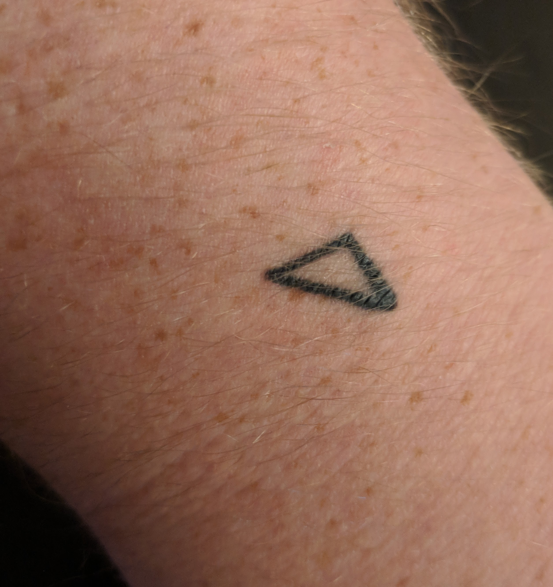

Aw damn, I didn't realize how long it'd been since I posted anything on here. While I work on something more substantial, here are a few items that bear mentioning.

## Recertificated

This site was effectively offline for several months because I forgot to renew the TLS. Won't let that happen again. I'm sure this was a great loss to everyone.

## Music

I haven't made anything in awhile but a few months back I produced a soundtrack for a friend's as-yet-unmade film, which I haven't released (yet), as well as a set of ten variations on the theme from said soundtrack, which I have. *Variations on Watching* is available on, you know, Spotify and Apple Music and Google Play Music and, uh, Tidal probably, or you can just click through it on Soundcloud.

<iframe width="100%" height="600" scrolling="no" frameborder="no" allow="autoplay" src="https://w.soundcloud.com/player/?url=https%3A//api.soundcloud.com/playlists/523616799&color=%23ff5500&auto_play=false&hide_related=false&show_comments=true&show_user=true&show_reposts=false&show_teaser=true&visual=true"></iframe>

I want to start with the music again soon, I have a few vague ideas but I'm still waiting for some true inspiration.

## ◸, the Wrist-Triangle, the Ur-Tat

I had a triangle tattooed onto my left wrist. The reasons both for getting a tattoo and for the triangle specifically are somewhat personal but I thought it was worth noting. Now I'm debating the best ways to expand it to other parts of my arm, probably slowly and with much premeditation.

A note: the actual triangle isn't right (unless you squeeze the skin a little bit in a certain way), but as a character it's approximated well enough by ◸.

## Me Being Likeable

A couple Saturdays ago one particular tweet, specifically a quote-retweet, "blew up", which for me means garnering two thousand likes. It wasn't the cleverest thing I've ever tweeted, I mean it's not bad but you have to be struck by the arbitrarity of any one particular zinger making it.. 

<blockquote class="twitter-tweet" data-lang="en">
I will vote for any despicable human-garbage candidate who advocates conversion to the metric system <a href="https://t.co/yKGDzkZSpc">https://t.co/yKGDzkZSpc</a>
&mdash; Eli T. Drumm (@chartrex) <a href="https://twitter.com/chartrex/status/1050985578286800896?ref_src=twsrc%5Etfw">October 13, 2018</a></blockquote>

I will tell you this: Twitter is so, so much more fun when you're getting notifications about someone liking or retweeting one of your tweets every thirty seconds. The sad twist ending is that out of all those two thousand likes, I gained exactly ONE (1) new follower. At this point I basically have given up trying to crack the multi-thousand-follower code let alone breaking two *hundred* followers. I don't think I'm that bad at Twitter, on the contrary it's one of the few things in life I think I'm mildly decent at. My theory is that Twitter in some sense solidified at some point and most people have exited the phase where they actively look out for new accounts to follow. I still look out, but a lot of that is probably to find people who might follow me back (this never works for me either).

If anyone has any thoughts or ideas about this let me know. I want more of that sweet, sweet someone-liked-your-tweet-notification opium...

## ..and what's next

I hope to move out of Indianapolis within the next quarter of a year. That's contingent on a few things but I have slightly more reason to be hopeful than I did two months ago, so here's to that.

I'll post again soon.
